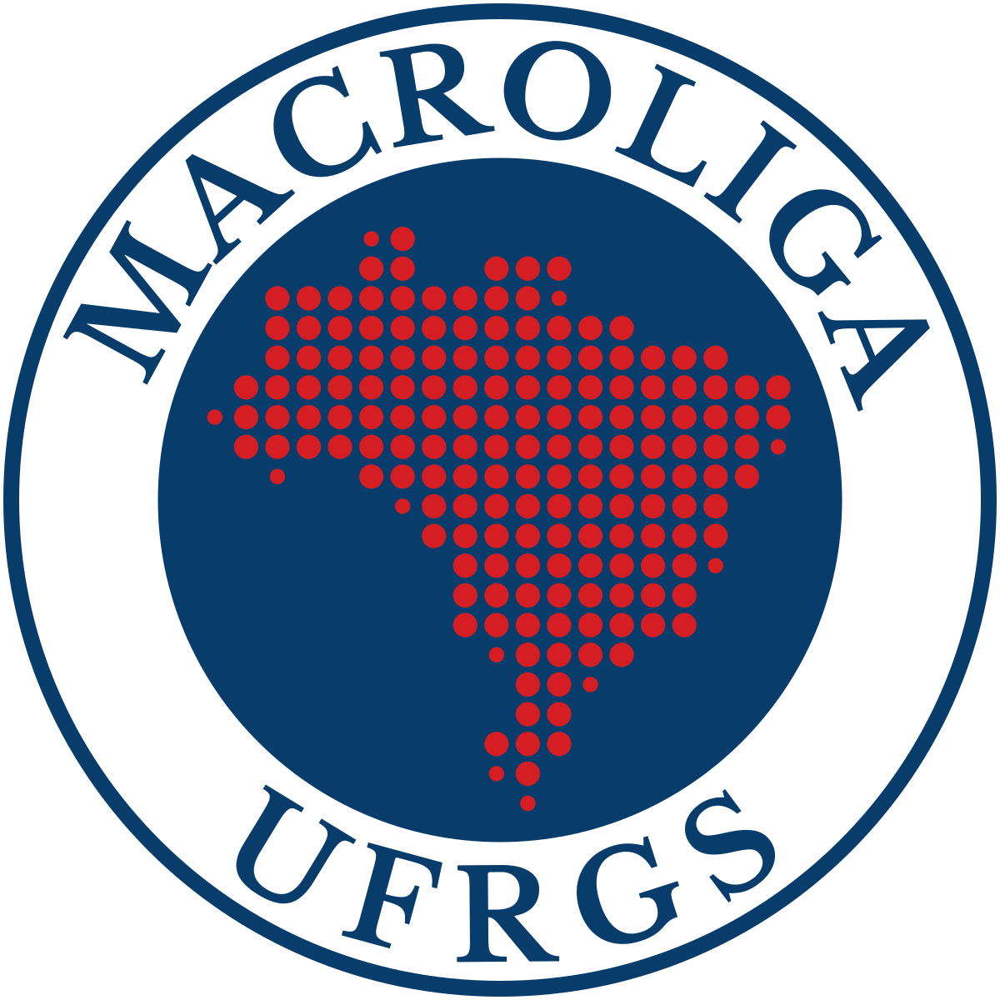

:::::: {.conteiner .pagina .sobre}

::::: {.sobre__abertura}
:::: {.sobre__missao}
# Sobre a liga

## Missão

A MacroLiga, um projeto idealizado e criado pelos alunos e alunas de Ciências Econômicas da Universidade Federal do Rio Grande do Sul, tem como objetivo a integração entre a teoria e prática científica e profissional na área da Macroeconomia. Por meio da elaboração e debate coletivo da produção científica, busca-se criar um ambiente propício para o domínio das competências necessárias ao exercício da profissão de economista.
::::
{.sobre__selo .so-desktop fig-alt="Selo da MacroLiga UFRGS" width="240" height="240"}
:::::

::::: {#como-funcionamos .sobre__etapas}
## Como funcionamos

Todo texto passa pelas mesmas quatro etapas.

```{=html}
<ol class="etapas etapas--longas">
<li class="etapa"><p class="etapa__titulo">1. Texto</p><p>Um membro escreve sobre um dos temas associados à macroeconomia. Nossos textos baseiam-se em análise de conjuntura, revisão de literatura, nota de pesquisa ou texto de opinião.</p></li>
<li class="etapa"><p class="etapa__titulo">2. Debate entre pares</p><p>Os membros leem e discutem o texto antes da revisão. A discussão testa os dados, os argumentos e a clareza.</p></li>
<li class="etapa"><p class="etapa__titulo">3. Revisão docente</p><p>Um professor revisa o texto, garantindo a qualidade acadêmica do texto.</p></li>
<li class="etapa etapa--publicacao"><p class="etapa__titulo">4. Publicação</p><p>Os textos aprovados formam um fascículo numerado. Cada texto recebe um DOI no Zenodo. O DOI é um identificador permanente: o link não quebra e o texto pode ser citado em trabalhos acadêmicos. Cada fascículo é lançado em um evento presencial na FCE, com um debatedor para cada texto.</p></li>
</ol>
```
:::::

::::: {.sobre__grade}
:::: {.sobre__eixos}
## Nossos eixos

::: {#lista-eixos}
:::
::::
:::: {.pluralidade .fundo-azul}
## Regra da pluralidade

A liga não toma posição sobre política econômica, governos ou partidos. Nossos membros têm visões teóricas diferentes, e isso faz parte do projeto. Criamos textos baseados em fatos. Eles mostram o que aconteceu, com número, data e fonte. A opinião de cada autor é de sua responsabilidade única e aparece só em seus textos individuais, assinados e identificados.
::::
:::::

::::: {.sobre__extensao}
{.sobre__selo .so-celular fig-alt="Selo da MacroLiga UFRGS" width="144" height="144"}

## Vínculo com a extensão

A MacroLiga UFRGS é um projeto de extensão da Faculdade de Ciências Econômicas (FCE) da UFRGS, na modalidade Produção e Publicação. A coordenação é do .

Extensão universitária é a atividade que leva à comunidade o conhecimento produzido na universidade. Por isso, todos os textos do site são abertos e gratuitos. Ao fim de cada texto e de cada fascículo, há um questionário curto. As respostas ajudam a avaliar o projeto.

::: {.acoes}
[Ver a equipe](equipe.qmd){.botao .botao--secundario}
[Ver as publicações](publicacoes/index.qmd){.botao .botao--secundario}
:::
:::::

::::::
